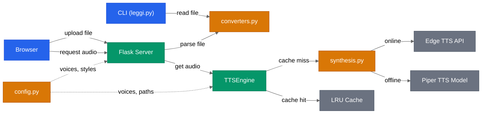
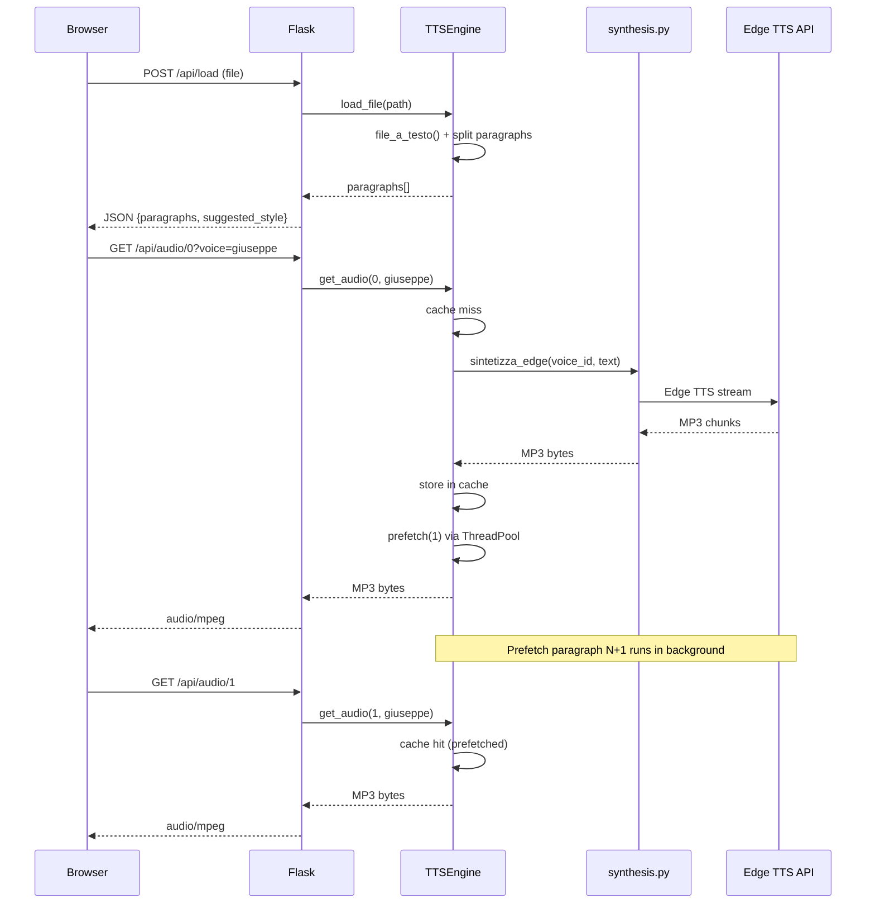
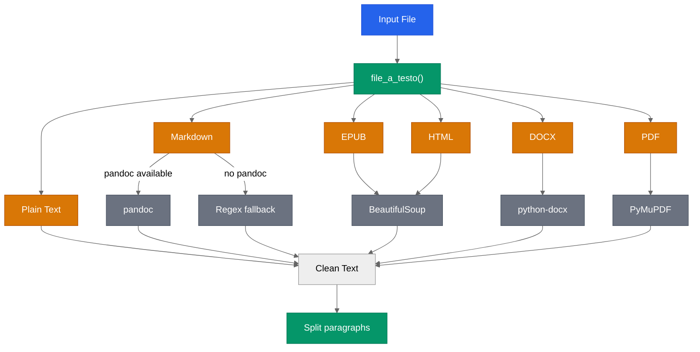

# Architecture

Technical diagrams for the TTS Reader project. For a high-level overview, see the [README](../README.md).

## System Architecture

Two entry points (Browser and CLI) share the same conversion and synthesis pipeline.

**Color legend:** blue = entry points, green = core engine, amber = internal modules, grey = external services/cache.

## Web Playback Sequence

Shows the full request lifecycle: file upload, audio synthesis with LRU cache, and automatic prefetch of the next paragraph via ThreadPoolExecutor.

Key details:

- **Cache key format:** `voice:style:index` (e.g. `giuseppe:neutro:0`)
- **Cache eviction:** LRU with max 50 entries (`OrderedDict`)
- **Prefetch:** triggered automatically on every `get_audio()` call for index+1
- **Edge TTS async:** runs on a dedicated `asyncio` event loop in a daemon thread, accessed via `run_coroutine_threadsafe`
- **Piper TTS:** synthesizes WAV, then converts to MP3 via `ffmpeg` pipe

## File Conversion Pipeline

`converters.py` dispatches to format-specific converters. The Markdown path has a graceful degradation: pandoc when available, regex stripping otherwise.

**Color legend:** blue = input, green = dispatch/output, amber = format types, grey = conversion tools.

After conversion, text is split on double newlines (`\n\n`) into paragraphs for sequential synthesis.
